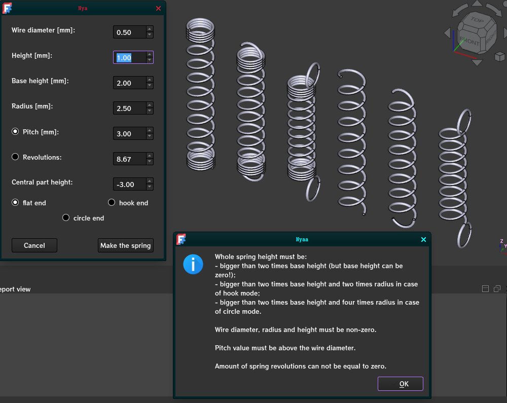
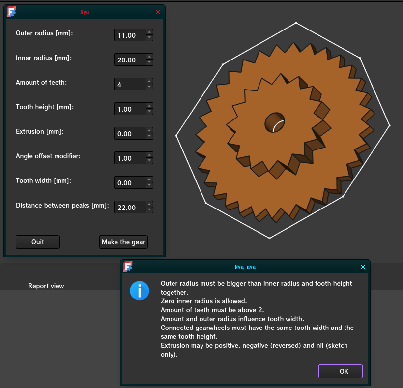
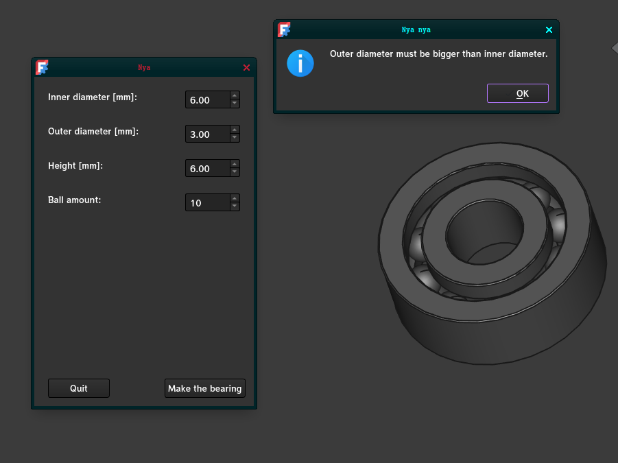
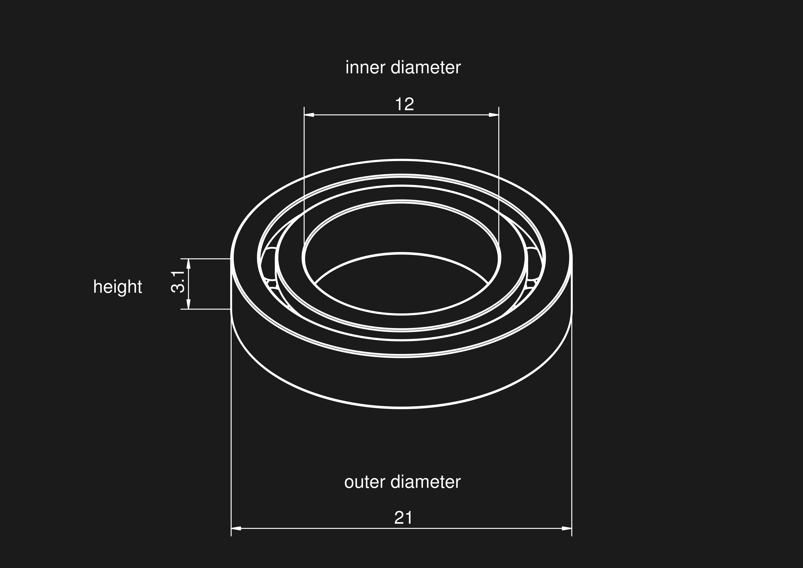

["If you need the right tools, invent them!"](https://www.youtube.com/watch?v=tCJ0Zs8DG3c)

# TechnoMacros
### Means to make mechanical components.

## README contents:

0. Requirements
1. Spring maker
2. Gear maker
3. Bearing maker 
4. Copyleft

## 0. Requirements
**FreeCAD** should have all of the necessary libraries to run it.
To run any of these macros, it is required to add them to FreeCAD Tools, which is explained somewhere on FreeCAD wiki.
I shall have made it documented by FreeCAD standards. Eventually.

## 1. Spring maker

### 1.1. What's this?
A program (macro) that takes spring parameters as user input and forms straight springs.
Default values were taken from ballpoint pen spring.

### 1.2. What's that?

*   Wire diameter: diameter of a wire that is extruded into a spring.
*   Height: whole distance, from one end to another, that the formed string occupies.
*   Base height: height of the part that has no pitch. If set to 0, the spring will be formed with set pitch for the whole height.
*   Radius: whole radius that the string shall have, from one side to the other.

*   Pitch: distance between loops. Smaller pitch means tightly-er packed loops.
*   Revolutions: amount of loops. Natural numbers place end point above the start of a spring. 
Pitch and revolutions values are **dependent** on each other and thus can **not** be edited simultaneously.

*   Central part height: calculated height of the spring without ends and bases.

Spring types:

    -   flat end
        Starts and ends with a spiral perpendicular to the spring axis. 
        Like that of a ballpoint pen.

    -   hook end 
        Starts and ends with a centered unclosed torus.

    -   circle end
        Starts and ends with a closed circle, placed exactly where the spiral ends.

    -   centered circle end (not shown on screenshot)
        Starts and ends with a closed circle, moved to the spring axis. 

##  2. Gear maker

### 2.1. What's this?
A program that forms cogwheels by data provided by a user. 
"Make the gear" may be pressed repeatedly to allow edits of the created gearwheel.

### 2.2. What's that?

*   Outer radius: maximal radius of the object; marks endpoints of each cog.
*   Inner radius: radius of a cutout circle. Natural values make a hole in the center; zero makes no hole; negative values put the circle beyond the outer radius (I do not know why I added the latter).
*   Amount of teeth: natural value corresponding to the amount of cogs.
*   Tooth height: distance between cog base and outer radius (cog endpoint), parallel to circle radius.
*   Extrusion: sign of the value changes direction by Z axis; 0 forms only sketch and excludes extrusion.
*   Angle offset modifier: alters the angle that a cog side is rotated by. Bigger values tilt the teeth outward.

*   Tooth width: calculated value corresponding to the tooth base width. Is not correct when **angle offset modifier** is not 1.
*   Distance between peaks: calculated value; distance between one endpoint and another. May be not quite correct with **angle offset modifier** different from 1.

## 5. Bearing maker

### 5.1. What's this?
A program that creates models of ball bearings.
Code originates from https://wiki.freecad.org/Scripted_Parts:_Ball_Bearing_-_Part_2.

### 5.2. What's that?

## 4. Copyleft

I allow usage and alternation of these scripts with or without my consent. 
I prohibit proclaims of ownership of this code by anyone other than me.

## Created by Viacheslav Pihida, Revenge-of-Shadow on Github; 24.05.2025

I love gearwheels.
